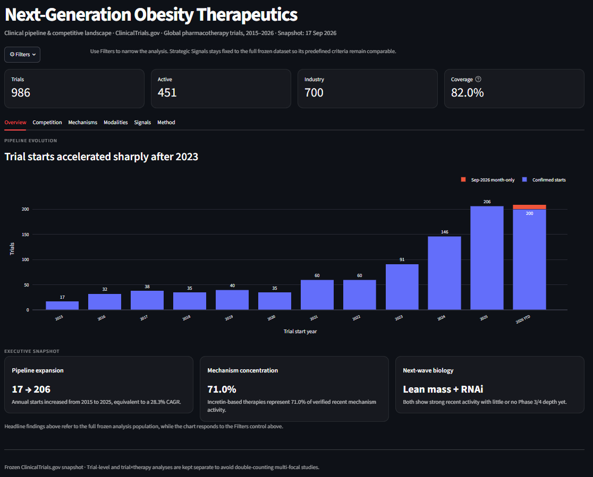
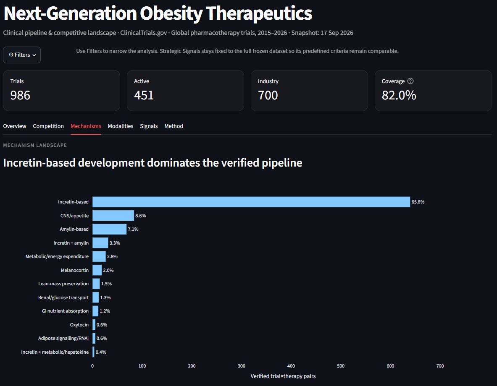
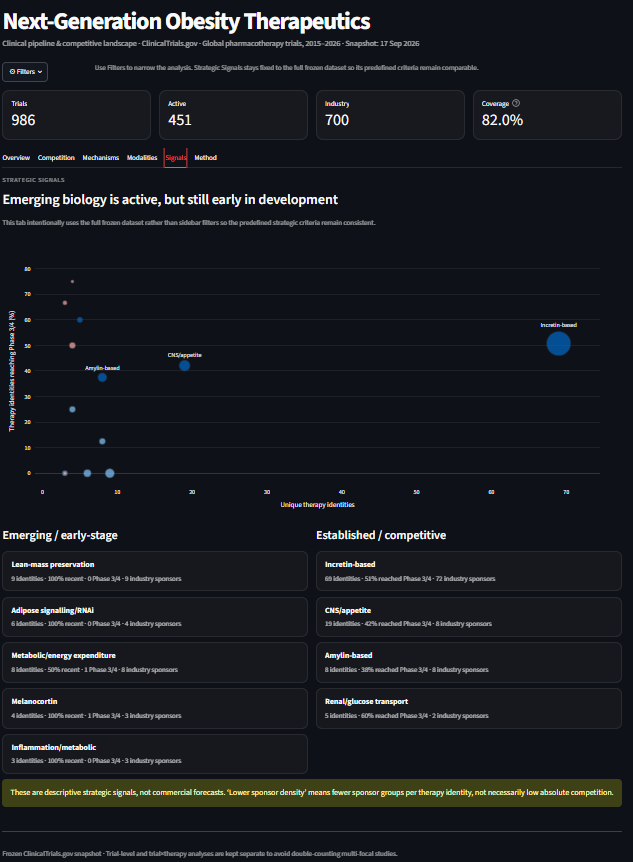

# Next-Generation Obesity Therapeutics
## Clinical Pipeline & Competitive Landscape

An end-to-end analysis of the global obesity pharmacotherapy clinical-development landscape using a frozen **ClinicalTrials.gov API v2** snapshot.

The project tracks how obesity drug development has evolved since 2015, identifies the most active sponsors and mechanisms, measures shifts in therapeutic modality, and highlights emerging areas of pipeline activity.

The final output is an interactive **Streamlit dashboard** supported by a cleaned and manually validated trial/therapy taxonomy.

---

## Dashboard preview

### Overview


### Mechanism Landscape


### Strategic signals


---

## Project overview

Obesity drug development has changed rapidly following the success of GLP-1 and multi-agonist therapies. This project was built to answer five questions:

1. **How quickly is the obesity pharmacotherapy pipeline growing?**
2. **Which companies are leading clinical-development activity?**
3. **Which mechanisms dominate the pipeline, and how has this changed over time?**
4. **How are therapeutic modalities evolving?**
5. **Which mechanisms show strong recent activity but limited late-stage development?**

The analysis distinguishes between:

- **Trial-level activity** — one row per clinical trial
- **Trial × focal-therapy activity** — one row per obesity therapy evaluated within a trial

This prevents multi-therapy studies from being incorrectly counted as a single mechanism.

---

## Headline findings

### Pipeline growth

- Annual trial starts increased from **17 in 2015 to 206 in 2025**
- This corresponds to a **28.3% CAGR**
- Trial starts grew **60.4% in 2024** and a further **41.1% in 2025**
- By **17 September 2026**, **200 trials** had definitely started
- A further **9 September 2026 month-precision records** could also have started by the snapshot date
- **17 future planned starts** were excluded from the 2026 YTD total

### Competitive landscape

Among **700 industry-sponsored trials**:

- **Novo Nordisk:** 138 trials
- **Eli Lilly:** 103 trials
- Top 2 sponsors account for **34.4%** of industry trials
- Top 5 sponsors account for **44.6%**
- Industry HHI = **690**, indicating a relatively fragmented sponsor landscape outside the two leaders

Portfolio breadth also differs materially by sponsor:

- **Novo Nordisk:** 35 therapy identities across 7 mechanism superfamilies
- **Eli Lilly:** 24 therapy identities across 5 mechanism superfamilies

### Mechanism evolution

Across **972 verified trial × therapy mechanism pairs**:

- **Incretin-based:** 65.8%
- **CNS/appetite:** 8.6%
- **Amylin-based:** 7.1%
- **Incretin + amylin:** 3.3%

The mechanism mix has shifted substantially:

| Mechanism | 2015–2022 | 2023–2026 YTD |
|---|---:|---:|
| Incretin-based | 54.2% | 71.0% |
| CNS/appetite | 18.2% | 4.1% |
| Amylin-based | 3.6% | 8.6% |
| Incretin + amylin | 0.6% | 4.5% |
| Lean-mass preservation | 0.3% | 2.2% |

### Modality evolution

Overall verified pipeline activity is dominated by:

- **Peptide-based:** 65.2%
- **Small molecule:** 20.0%
- **Combination / mixed modality:** 6.9%
- **Antibody / protein biologic:** 6.7%
- **RNA / oligonucleotide:** 0.6%

Recent development shows greater modality diversification:

- Antibody/protein biologics increased from **4.2% → 8.0%**
- RNA/oligonucleotide therapies appear only in the recent period in this dataset

### Emerging pipeline signals

Several mechanisms combine strong recent activity with limited late-stage depth:

| Mechanism | Therapy identities | Recent activity | Phase 3/4 identities |
|---|---:|---:|---:|
| Lean-mass preservation | 9 | 100% | 0 |
| Adipose signalling / RNAi | 6 | 100% | 0 |
| Inflammation / metabolic | 3 | 100% | 0 |
| Melanocortin | 4 | 100% | 1 |
| Metabolic / energy expenditure | 8 | 50% | 1 |

These are **descriptive pipeline signals rather than commercial forecasts**.

---

## Dataset

### Source

Clinical trial data were collected using the **ClinicalTrials.gov API v2**.

Frozen candidate dataset:

- **2,283 trials**
- **5,278 interventions**
- **24,763 locations**
- **899 collaborators**

The API snapshot was intentionally frozen before cleaning and classification so downstream results remain reproducible.

### Raw data

The analysis was built from a frozen ClinicalTrials.gov API v2 snapshot collected on 17 September 2026.

The raw JSON snapshot (~93 MB) is not included in this repository due to file size.

The extraction logic is available in `src/fetch_trials.py`. The processed datasets used for the published analysis and dashboard are included under `data/processed/`.

Running the extraction script again may produce different results because ClinicalTrials.gov records are continually updated.

### Final analysis population

After scope review and intervention-role adjudication:

- **986 included clinical trials**
- **1,186 unique trial × focal-therapy pairs**
- **371 canonical therapy identities**
- **972 verified / verified-alias mechanism pairs**
- **26 researched but publicly unresolved pairs**
- **188 unreviewed long-tail pairs**
- **0 identity-mapping conflicts**

Mechanism coverage across the final trial × therapy dataset is therefore **82.0%**.

---

## Scope

Included studies were global ClinicalTrials.gov interventional trials starting from **2015–2026** where pharmacological treatment of obesity/overweight was a central development objective.

The scope includes:

- Weight-loss efficacy trials
- Dose-ranging studies
- PK/PD and safety studies supporting obesity drug development
- Formulation and regulatory-development studies
- Repurposed drugs deliberately tested for weight reduction
- Obesity subtypes and genetically defined obesity programmes

The scope excludes:

- Nutraceuticals and traditional/herbal interventions
- Food-derived or dietary interventions
- Non-pharmacological procedures
- Bariatric supportive medications
- Mechanistic challenge studies unrelated to therapy development
- Drugs studied only because participants had obesity
- Therapies primarily targeting unrelated comorbidities
- Duplicate standalone mechanistic substudies where inclusion would inflate programme counts

---

## Data-processing workflow

The analysis was built as a staged pipeline rather than a single notebook.

### 1. API extraction

ClinicalTrials.gov records were collected through API v2 and stored as frozen raw data.

### 2. Trial-level cleaning

Trial metadata were normalised into a structured table including:

- Study phase
- Recruitment status
- Sponsor
- Enrollment
- Study design
- Start/completion dates
- Eligibility
- Intervention details

### 3. Scope adjudication

Potential false-positive obesity studies were reviewed using trial purpose, intervention role and endpoints.

This removed studies where obesity was merely:

- an eligibility characteristic,
- a comorbidity,
- or unrelated to the drug's development purpose.

### 4. Intervention-role classification

Each relevant intervention was assigned a role such as:

- `FOCAL_OBESITY_THERAPY`
- `ACTIVE_COMPARATOR`
- `PK_DDI_PROBE`
- `BACKGROUND_OR_CONCOMITANT`
- `CONTROL_PLACEBO`
- `OUT_OF_SCOPE`

This avoided incorrectly treating comparators, concomitant drugs or pharmacokinetic probes as obesity therapies.

### 5. Therapy identity resolution

Intervention names were canonicalised to collapse:

- aliases,
- development codes,
- formulation names,
- device labels,
- and sponsor-specific naming conventions.

This produced **371 canonical therapy identities**.

### 6. Mechanism taxonomy

Therapies were classified across fields including:

- Mechanism superfamily
- Mechanism family
- Molecular target
- Mechanism/action
- Modality
- Incretin status
- Agonist order
- Classification confidence
- Source/reference status

Obscure or publicly undisclosed mechanisms were retained as unresolved rather than inferred aggressively.

### 7. Analysis master tables

The final cleaned trial and therapy taxonomies were joined into:

- a **trial master table**
- a **trial × therapy master table**

These power the downstream competitive, mechanism, modality and maturity analyses.

---

## Analysis modules

The project includes separate analytical modules for:

### Pipeline evolution
Tracks annual trial starts and development-stage mix from 2015–2026.

### Sponsor competition
Measures trial volume, recent starts, active trials, therapy-portfolio breadth, mechanism breadth, Phase 3/4 exposure and market concentration.

### Mechanism landscape
Compares mechanism mix overall, by year, by pipeline stage, and between **2015–2022 vs 2023–2026 YTD**.

### Modality landscape
Tracks shifts between peptides, small molecules, antibody/protein biologics, RNA/oligonucleotide therapies, mixed/combination approaches and other modalities.

### Pipeline maturity
Measures mechanism maturity using the **highest observed development stage per therapy identity**, rather than raw trial count alone.

### Strategic signals
Combines therapy breadth, recent activity, late-stage penetration and sponsor density to distinguish emerging early-stage areas from established competitive mechanisms.

No black-box commercial opportunity score is used.

---

## Dashboard

The interactive Streamlit dashboard contains six sections:

- **Overview** — pipeline growth and executive findings
- **Competition** — sponsor activity and portfolio breadth
- **Mechanisms** — mechanism dominance and historical shifts
- **Modalities** — therapeutic modality evolution
- **Signals** — emerging vs established mechanism patterns
- **Method** — scope, classification coverage and methodology

### Run locally

Install the required packages:

```bash
pip install -r requirements.txt
```

Then launch the dashboard:

```bash
streamlit run app.py
```

---

## Project structure

```text
obesity-clinical-trials-landscape/
│
├── app.py
├── README.md
├── requirements.txt
├── dashboard_requirements.txt
│
├── data/
│   ├── raw/
│   └── processed/
│
├── notebooks/
│
├── outputs/
│   └── figures/
│
└── src/
    ├── data extraction
    ├── cleaning / scope review
    ├── intervention-role adjudication
    ├── taxonomy construction
    └── analysis scripts
```

---

## Methodological notes

### 2026 YTD

The snapshot date is **17 September 2026**.

ClinicalTrials.gov reports some start dates only to month precision.

Therefore:

- **200** 2026 trials were definitely started by the snapshot date
- **9** September 2026 trials had month-level precision and uncertain exact timing
- **17** trials had reported starts after the snapshot and were excluded from YTD counts

The dashboard uses the conservative **200 confirmed starts** as its headline 2026 YTD figure.

### Mechanism-share calculations

Mechanism-share charts use only `VERIFIED` and `VERIFIED_ALIAS` pairs.

Unresolved and unreviewed long-tail therapies remain in the dataset but are excluded from mechanism-share denominators.

### Multi-therapy trials

Trial-level and trial × therapy analyses are deliberately kept separate.

This prevents a trial evaluating multiple focal obesity therapies from being double-counted in trial totals or undercounted in mechanism/therapy analyses.

---

## Limitations

This project should be interpreted as a **clinical-development landscape**, not a complete commercial forecast.

Important limitations include:

- ClinicalTrials.gov does not contain every global trial
- Sponsor naming and asset naming change over time
- Some experimental mechanisms are not publicly disclosed
- 15.9% of focal pairs remain unreviewed long-tail assets
- Trial counts do not measure clinical efficacy or probability of approval
- Sponsor counts do not capture licensing economics, partnerships or commercial rights
- A high number of trials does not necessarily imply a broader or stronger portfolio

The strategic-signal analysis is therefore descriptive rather than predictive.

---

## Tools

- **Python**
- **pandas**
- **ClinicalTrials.gov API v2**
- **Plotly**
- **Streamlit**
- **Matplotlib**
- **Git / GitHub**

---

## Skills demonstrated

- API data extraction
- Clinical-trial data cleaning
- Data-quality validation
- Manual and automated taxonomy construction
- Entity/alias resolution
- Pharmaceutical pipeline analysis
- Competitive-landscape analysis
- Data visualisation
- Interactive dashboard development
- Strategic interpretation of life-sciences data

---

## Next steps

Potential extensions include:

- Geographic analysis of trial activity
- Sponsor collaboration/network mapping
- Route-of-administration analysis
- Target-level competition rather than mechanism-superfamily level
- Linking trial assets to clinical efficacy data
- Linking pipeline assets to transactions/licensing data
- Adding probability-of-success or commercial-stage overlays

---

## Author

**Daniel Davison**  
MEng Molecular Bioengineering, Imperial College London
